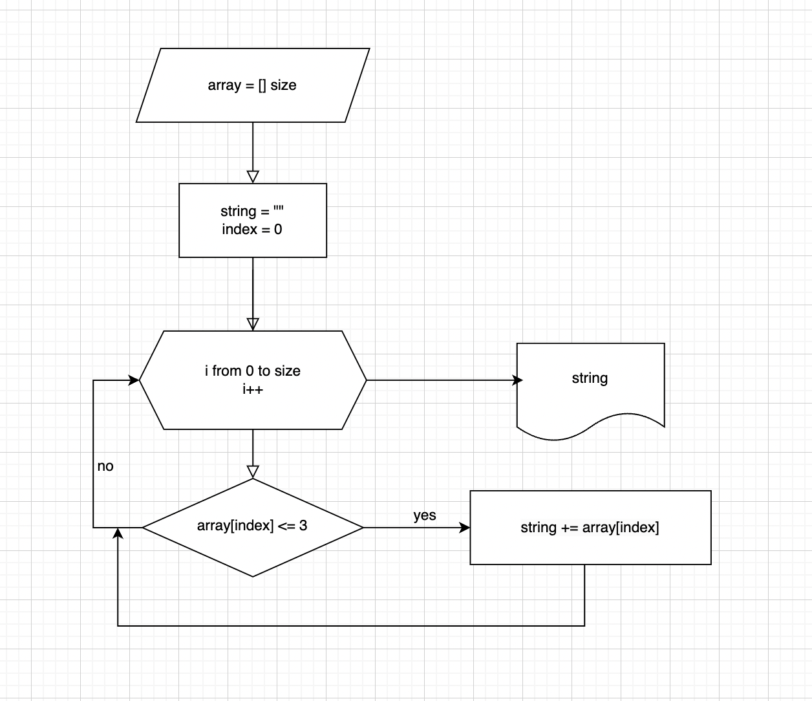

## Дана задача:  Написать программу, которая из имеющегося массива строк формирует новый массив из строк, длина которых меньше, либо равна 3 символам. 

В моём алгоритме перебирается каждый элемент заданного массива, при этом проверяется длина элементов. Элементы с длиной <= 3 записываются в новую строку. Затем строка преобразовывается в массив и мы получаем нужный массив. 

